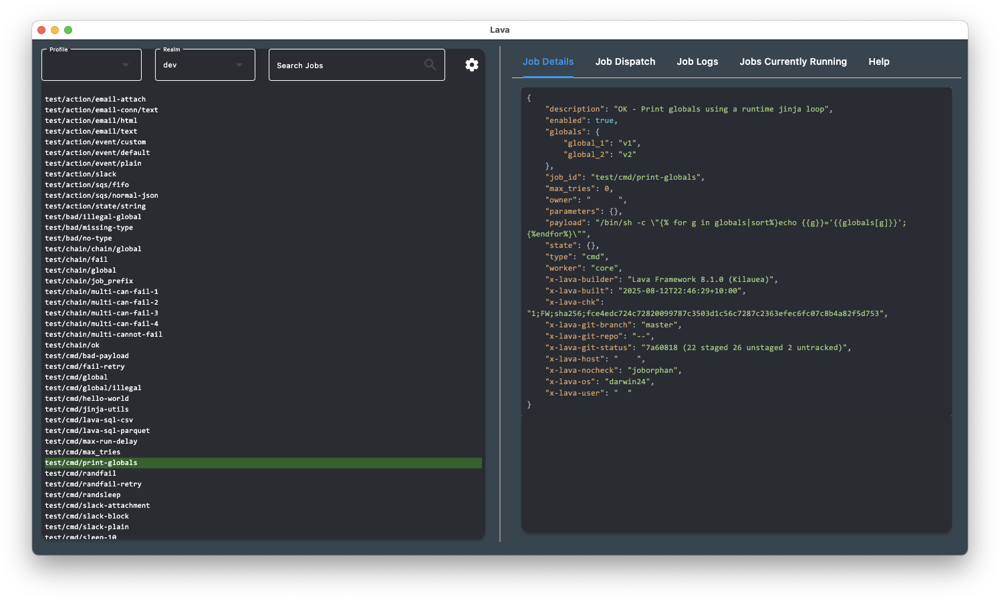

# Lava GUI

The **lava GUI** is a standalone GUI client for
[lava](https://github.com/jin-gizmo/lava) built on [Flet](https://flet.dev) /
[Flutter](https://flutter.dev/). It's fairly basic but surprisingly handy,
particularly when working across multiple lava realms and AWS accounts.

## Genesis

**Lava** was developed at [Origin Energy](https://www.originenergy.com.au)
as part of the *Jindabyne* initiative. While not part of our core IP, it proved
valuable internally, and we're sharing it in the hope it's useful to others.

Kudos to Origin for fostering a culture that empowers its people
to build complex technology solutions in-house.

## Downloads

Pre-built versions of the GUI are available for download:

*   [Latest release](https://github.com/jin-gizmo/lava-gui/releases/latest)

*   [All releases](https://github.com/jin-gizmo/lava-gui/releases)

## Building the App

*   [Build instructions for macOS](doc/build-macos.md) : This will build a macOS
    app packaged in a DMG file.

*   [Build instructions for Windows](doc/build-windows.md) : This will build a
    Windows app packaged in a Windows installer EXE.

## App Configuration

See the [user guide](doc/USAGE.md). This is also available in the help panel in
the app.

## Installation

See the [installation guide](doc/INSTALL.md).

## Release Notes

See [doc/RELEASE-NOTES.md](doc/RELEASE-NOTES.md).

## Credits

This version is a substantial rewrite of the old GUI, which was pretty terrible.
Thanks to Art Dorokhov, Nyan Min Khant (Michael), and Alex Boul for the rewrite.

See also [doc/CREDITS.md](doc/CREDITS.md).
