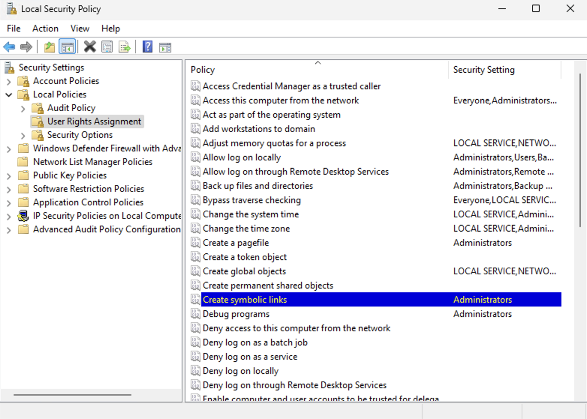
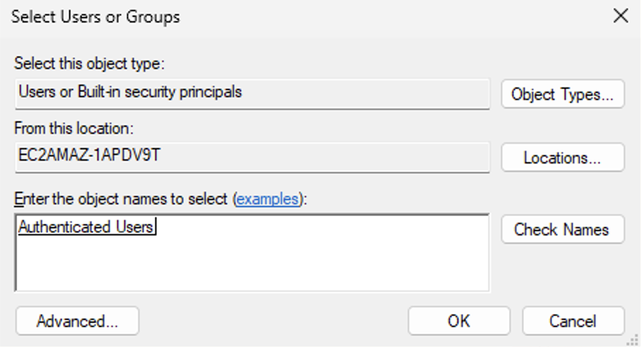
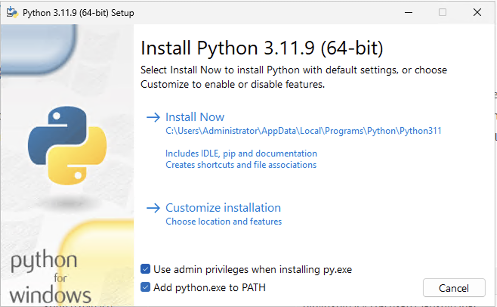
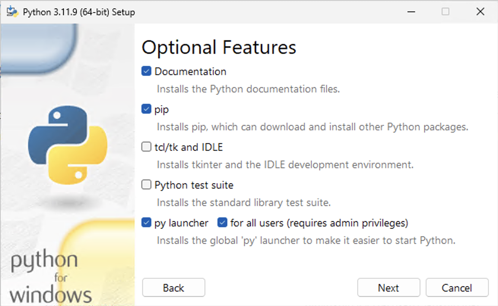
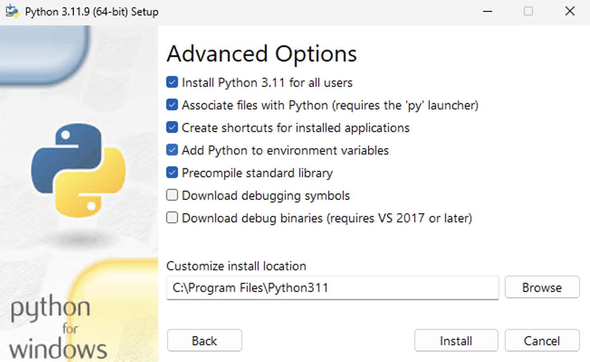

# Building the Lava GUI on Windows

These instructions explain how to build the app on Windows using an AWS EC2
instance. The (very minimal) [Windows installation
guide](https://flet.dev/docs/publish/windows/) provided with Flet applies to
Windows Desktop. AWS EC2 instances run Windows Server. This requires changes to
the installation procedure.

> [!TIP]
> You might want to grab a sandwich and a thermos of tea. And possibly a Sudoku
> or two. 

## Prerequisites

You will need:

1. [An AWS EC2 instance running Windows](#aws-ec2-with-windows).
2. [Git](#git)
3. [Visual Studio 2022](#visual-studio-2022)
4. [Flutter](#flutter)
5. [Python](#python)
6. [Inno Setup](#inno-setup)
7. [GNU make](#gnu-make)

Having done all this, it's a good idea to snapshot the machine image as an AMI.
This is not something you want to do more than once.

### AWS EC2 with Windows

Create an AWS EC2 instance with this configuration:

*   **AMI:** `Windows_Server-2025-English-Full-Base-2025.07.09` (or current
    equivalent thereof)
*   **Instance Type:** `t3.large` or larger. (You can *possibly* do it on a
    `t3.medium` but you're not getting any younger you know.)
*   **Storage:** 80GB. No kidding.

As a Windows Server edition, this will be missing a bunch of critical stuff
needed for the process.

#### Root Certificates

Run the following in PowerShell to install the root certificates needed to allow
Dart to work. Dart is used by Flutter.

```powershell
certutil -generateSSTFromWU roots.sst
Import-Certificate -FilePath .\roots.sst -CertStoreLocation Cert:\LocalMachine\Root
```

#### Enabling Symlinks

By default, Windows Server only allows administrators to create symlinks. This
will cause problems when cloning the lava GUI repo as it relies on symlinks. To
enable all authenticated users to create symlinks:

1.  Press **Win + R**, type `secpol.msc`, and press **Enter**
2.  Navigate to `Security Settings > Local Policies > User Rights Assignment`
3.  Find and double-click **Create symbolic links** (as shown in the first
    screenshot below)
4.  Add `Authenticated Users` as shown in the second screenshot.





#### Long Pathnames

By default, Windows Server has a 260 character limit on pathnames. This can be a
problem so it's important to *enable long path support*. Google it.

#### AWS CLI

The AWS CLI is useful for configuring profiles for testing. Run the following in
PowerShell or CMD prompt:

```powershell
msiexec.exe /i https://awscli.amazonaws.com/AWSCLIV2.msi
```

### Git

Download the installer from the [official Git
website](git-scm.com%20https%3A//git-scm.com/downloads/win) The default settings
should mostly be fine, but do **make sure to include Git bash**.

> [!IMPORTANT] 
> Unless otherwise indicated, the CLI commands shown below should be executed in 
> Git bash.

Make sure Git is configured to preserve symlinks:

```bash
git config --get local.symlinks
```

### Visual Studio 2022

> [!IMPORTANT]
> The installation process requires *Visual Studio* **not** *Visual Studio Code*.

Download the *Visual Studio 2022* (Community Edition) installer from the [Visual
Studio website](https://visualstudio.microsoft.com/downloads/) and run the
installer.

Flutter requires the following components be installed:

* *Desktop development with C++* workload
* MSVC v142 - VS 2019 C++ x64/x86 build tools
* C++ CMake tools for Windows
* Windows 10 SDK

Due to the EC2 instance running Windows Server, the installer will not make some
of these components available, notably the C++ workload.

To make them available, select the `More ...` option on the installer home
screen and then select `Repair`. This should download a bunch of additional
components.

Restart the instance. (It’s Windows, so doing anything requires a restart,
naturally.)

Rerun the Visual Studio installer, select the components above and install.  As
you will be installing on a day ending in “y”, you will probably need to restart
again. Who knows? Flutter will tell us if all the required components are
present.

### Flutter

Install Flutter from the [Flutter
website](https://docs.flutter.dev/get-started/install/windows/desktop). Make
sure the `bin` directory within the Flutter install area is added to the PATH.

Try:

```bash
flutter --version
```

You should see something like this:

```bare
Flutter 3.32.7 • channel stable • https://github.com/flutter/flutter.git
Framework • revision d7b523b356 (4 days ago) • 2025-07-15 17:03:46 -0700
Engine • revision 39d6d6e699 (4 days ago) • 2025-07-15 15:39:12 -0700
Tools • Dart 3.8.1 • DevTools 2.45.1
```

Run the following commands

```bash
# First, stop flutter from phoning home
flutter --disable-analytics

# Check if our installation is healthy
flutter doctor
```

You should see something like this:

```bare
Doctor summary (to see all details, run flutter doctor -v):
[√] Flutter (Channel stable, 3.32.7, on Microsoft Windows [Version 10.0.26100.4652], locale en-US)
[√] Windows Version (Windows 11 or higher, 24H2, 2009)
[X] Android toolchain - develop for Android devices
      ... More loser spam ... ignore it.

[X] Chrome - develop for the web (Cannot find Chrome executable at .\Google\Chrome\Application\chrome.exe)
    ! Cannot find Chrome. Try setting CHROME_EXECUTABLE to a Chrome executable.
[√] Visual Studio - develop Windows apps (Visual Studio Community 2022 17.14.9 (July 2025))
[!] Android Studio (not installed)
[√] Connected device (2 available)
[√] Network resources

! Doctor found issues in 3 categories.
```

The crucial bit here is `[√] Visual Studio - develop Windows apps`. This
indicates the install is fine.

If Flutter indicates any essential components missing from the [Visual
Studio](#Visual-Studio), re-run the Visual Studio installer to add them and try
`flutter doctor` again.

### Python

Download Python from [python.org](https://www.python.org/downloads/windows/) and
run the installer.

> [!NOTE]
> Python 3.11.9 is shown in the screenshots. Any version 3.11 or above should be fine.

Choose the custom install option.







### Inno Setup

[Inno Setup](https://jrsoftware.org/isinfo.php) is used to create a Windows
installer for the app. Download and install it.

An installer script to build an install package is provided in the lava GUI repo and the Makefile will do all the work for you.

### GNU Make

The build process is controlled by a Makefile. To install **make** in Git bash:

```bash
 curl -L -o make-4.4.1-without-guile-w32-bin.zip \
    winhttps://sourceforge.net/projects/ezwinports/files/make-4.4.1-without-guile-w32-bin.zip/download
unzip -d /mingw64/ make-4.4.1-without-guile-w32-bin.zip
```

> [!IMPORTANT]
> Ensure `/mingw64/bin` is in PATH.

## Building the app

> [!IMPORTANT]
> Unless otherwise indicated, the CLI commands shown below should be executed in
> Git bash.

Once all the prerequisites are in place, the actual GUI app can be built.

### Preparation

```bash
# Clone the repo
git clone git@github.com:jin-gizmo/lava-gui.git

# Setup a virtual environment and install Python dependencies
make init

# Activate the venv -- different path than for UNIX-like systems.
source venv/Scripts/activate
```

> [!TIP]
> The Flet build process can occasionally be prone to cache problems. It can
> be a good idea to delete the `dist/windows` directory first in the event of problems using `make clean`.

### Makefile Build Targets

The key `Makefile` build targets are described below. As always, `make help` is your friend.

| Target    | Description                                                  |
| --------- | ------------------------------------------------------------ |
|           | Print help.                                                  |
| help      | Print help.                                                  |
| init      | Initialise the virtual environment. Idempotent.              |
| preflight | Check the prerequisites are in place. It's a good idea to run this first. |
| build     | Build the app executable `dist/windows/build/lavagui.exe`    |
| installer | Build the app installer  `dist/windows/lavagui-<VERSION>-windows-x64.exe` |
| app       | Shortcut for `build` +  `installer`                          |
| clean     | Delete `dist/windows` and its contents.                      |

### The Build

The short version is:

```bash
# Check we're ready to build
make preflight
# Build the app, package into an installer exe using Inno Setup.
make app
```

The installer should appear as `dist/windows/lavagui-<VERSION>-windows-x64.exe`.

This process will take a reasonable amount of time to do the following:

1.  Create a staging copy of the source code in `dist/windows/staging`.
2.  Build the Flet app in `dist/windows/build`. You can run the the app from
    here by opening the folder in the file explorer and double clicking on
    `lavagui.exe`.  (This takes quite a while.)
3.  Package the app into an installer `dist/windows/lavagui-<VERSION>-windows-x64.exe`

The installer is distributable, as required.

## Running the app from Source on Windows

In the event of problems, it can be helpful to run the Flet app directly from
the Python source. To do this, first install the Python prerequisites.

```bash
# Assuming the repo has already been cloned and virtualenv is active ...
flet run
```

## Running the Built app

> [!IMPORTANT]
> The app will be *very* slow to start on first use. Really, really slow. Be patient. Subsequent starts should be
> no worse than normal on DOS.

For testing purposes, `lavagui.exe` can be run directly from the `dist/windows`
directory.
